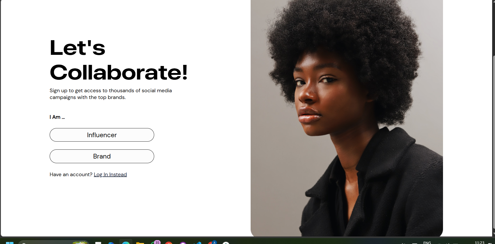
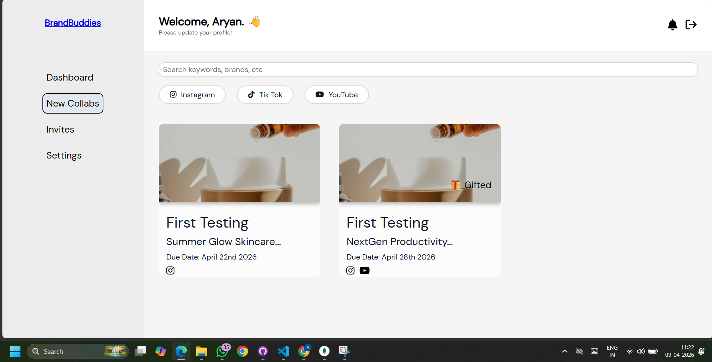
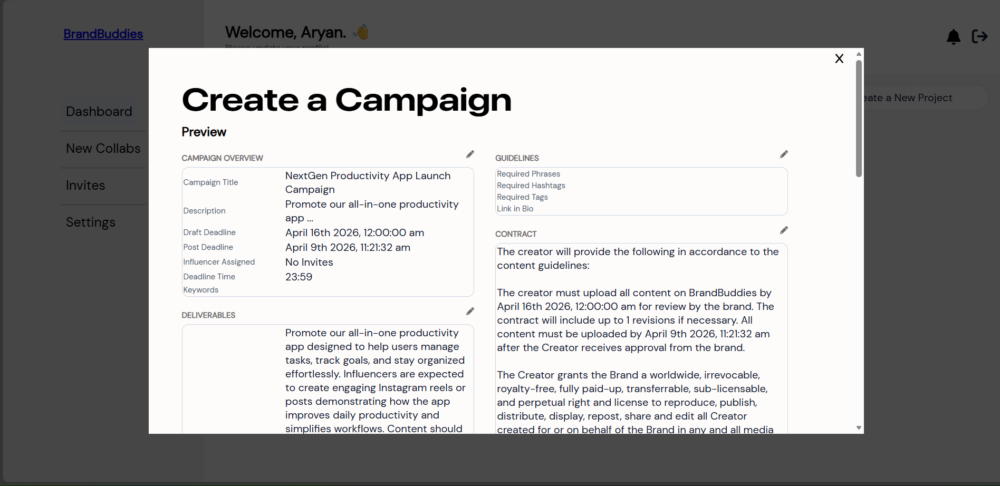
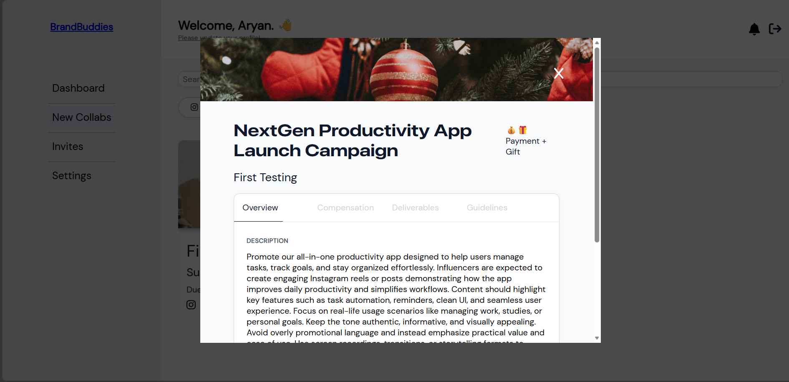
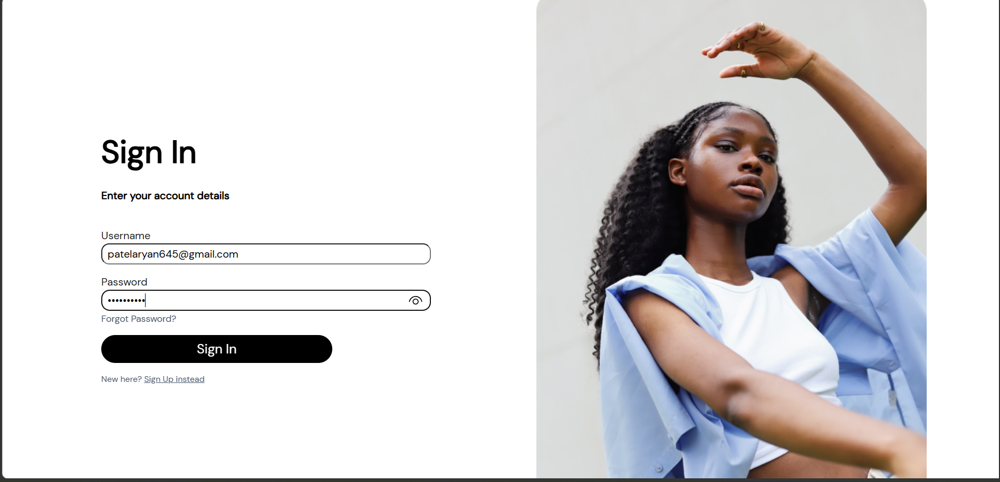

# 🤝 BrandBuddies - Brand & Influencer Collaboration Platform

<div align="center">



### **Connect Brands with Influencers for Seamless Campaign Collaboration**

[](https://reactjs.org/)
[](https://nodejs.org/)
[](https://www.mongodb.com/)
[](https://expressjs.com/)

[Features](#-key-features) • [Demo](#-screenshots) • [Installation](#-installation) • [Tech Stack](#-tech-stack) • [Deployment](#-deployment)

</div>

---

## 📖 Overview

**BrandBuddies** is a comprehensive full-stack platform that bridges the gap between brands and social media influencers. Built with modern web technologies, it streamlines the entire collaboration workflow—from campaign creation and influencer discovery to contract management and payment processing.

### 🎯 Why BrandBuddies?

- **Streamlined Campaigns**: Create, manage, and track social media campaigns effortlessly
- **Multi-Platform Support**: Support for Instagram, TikTok, and YouTube campaigns
- **Smart Matching**: Connect brands with the right influencers based on campaign requirements
- **Contract Management**: Built-in contract templates with customizable guidelines
- **Secure Payments**: Integrated Stripe payment system with gift/payment tracking
- **Real-time Updates**: Get notified about campaign status changes and invitations
- **Professional Dashboard**: Intuitive interface for both brands and influencers

---

## ✨ Key Features

### For Brands 🏢

- **Campaign Creation & Management**
  - Create detailed campaigns with deliverables, deadlines, and compensation
  - Define content guidelines and requirements (hashtags, tags, phrases)
  - Set platform-specific requirements (Instagram, TikTok, YouTube)
  - Track campaign progress and status

- **Influencer Discovery**
  - Search and filter influencers by keywords and platform
  - View influencer profiles and social media presence
  - Send collaboration invitations
  - Review influencer applications

- **Contract & Compliance**
  - Auto-generated contracts with customizable terms
  - Content approval workflow with revision management
  - Rights and licensing agreements
  - Deadline tracking

### For Influencers 🌟

- **Opportunity Discovery**
  - Browse available campaigns from top brands
  - Filter by platform, compensation, and interests
  - Receive personalized campaign invitations

- **Campaign Management**
  - Accept or negotiate campaign terms
  - View detailed deliverables and guidelines
  - Track deadlines and requirements
  - Upload content for brand review

- **Profile Management**
  - Showcase social media statistics
  - Link Instagram, TikTok, and YouTube accounts
  - Build professional portfolio
  - Track earnings and completed campaigns

### Core Platform Features 🚀

- **Role-Based Access Control**: Separate interfaces for Brands, Influencers, and Admins
- **Real-time Notifications**: Stay updated on campaign status, invitations, and approvals
- **File Management**: Upload campaign assets and deliverables with AWS S3 integration
- **Payment Processing**: Secure payment handling through Stripe
- **Responsive Design**: Seamless experience across desktop, tablet, and mobile
- **Search & Filtering**: Advanced search capabilities with keyword and platform filters

---

## 📸 Screenshots

### Landing Page


_Clean, professional landing page with role selection_

### User Dashboard


_Intuitive dashboard showing active campaigns and collaborations_

### Campaign Creation


_Comprehensive campaign creation with preview, guidelines, and contracts_

### Project Details


_Detailed campaign view with description, compensation, and deliverables_

### Sign In


_Secure authentication with clean, modern design_

---

## 🛠 Tech Stack

### Frontend

- **React 18.2** - Modern UI library with hooks
- **React Router v6** - Client-side routing and navigation
- **Sass/SCSS** - Advanced styling with variables and mixins
- **Axios** - Promise-based HTTP client
- **FontAwesome** - Professional icon library
- **Stripe React** - Payment integration components
- **Body Scroll Lock** - Enhanced UX for modals

### Backend

- **Node.js** - JavaScript runtime environment
- **Express.js** - Fast, minimalist web framework
- **MongoDB** - NoSQL database for flexible data storage
- **Mongoose** - Elegant MongoDB object modeling
- **JWT** - Secure authentication with JSON Web Tokens
- **Bcrypt.js** - Password hashing and encryption
- **Multer** - Multipart/form-data handling for file uploads
- **AWS SDK** - Amazon S3 integration for file storage

### Additional Services

- **Stripe** - Payment processing and invoicing
- **AWS S3** - Secure cloud file storage
- **MongoDB Atlas** - Cloud database hosting

---

## 🏗 System Architecture

```
┌─────────────────────────────────────────────────────────────┐
│                    Client Layer (React)                      │
│  ┌──────────┐  ┌──────────┐  ┌──────────┐  ┌──────────┐   │
│  │Dashboard │  │Campaigns │  │ Profile  │  │  Auth    │   │
│  └──────────┘  └──────────┘  └──────────┘  └──────────┘   │
└─────────────────────────────────────────────────────────────┘
                            │
                            ▼
┌─────────────────────────────────────────────────────────────┐
│                  API Layer (Express REST)                    │
│  ┌──────────┐  ┌──────────┐  ┌──────────┐  ┌──────────┐   │
│  │   Auth   │  │  Users   │  │ Projects │  │ Payments │   │
│  │  Routes  │  │  Routes  │  │  Routes  │  │  Routes  │   │
│  └──────────┘  └──────────┘  └──────────┘  └──────────┘   │
└─────────────────────────────────────────────────────────────┘
                            │
                            ▼
┌─────────────────────────────────────────────────────────────┐
│                   Business Logic Layer                       │
│  ┌──────────┐  ┌──────────┐  ┌──────────┐  ┌──────────┐   │
│  │   Auth   │  │Campaign  │  │   File   │  │ Payment  │   │
│  │ Manager  │  │ Manager  │  │ Manager  │  │ Manager  │   │
│  └──────────┘  └──────────┘  └──────────┘  └──────────┘   │
└─────────────────────────────────────────────────────────────┘
                            │
                            ▼
┌─────────────────────────────────────────────────────────────┐
│                      Data Layer                              │
│  ┌──────────┐  ┌──────────┐  ┌──────────┐  ┌──────────┐   │
│  │ MongoDB  │  │  AWS S3  │  │  Stripe  │  │   JWT    │   │
│  │  Atlas   │  │  Bucket  │  │   API    │  │  Tokens  │   │
│  └──────────┘  └──────────┘  └──────────┘  └──────────┘   │
└─────────────────────────────────────────────────────────────┘
```

---

## 📥 Installation

### Prerequisites

Ensure you have the following installed:

- **Node.js** v16 or higher ([Download](https://nodejs.org/))
- **npm** or **yarn** package manager
- **MongoDB** - Local installation or [MongoDB Atlas](https://www.mongodb.com/cloud/atlas) account
- **Git** version control

### Quick Start (5 Minutes)

1. **Clone the Repository**

   ```bash
   git clone https://github.com/yourusername/brandbuddies-platform.git
   cd brandbuddies-platform
   ```

2. **Install Client Dependencies**

   ```bash
   cd Major_Project_Client_Enhanced
   npm install
   ```

3. **Install Server Dependencies**

   ```bash
   cd ../Major_Project_Server_Enhanced
   npm install
   ```

4. **Start Development Servers**

   **Terminal 1 - Backend Server**

   ```bash
   cd Major_Project_Server_Enhanced
   npm run dev
   ```

   Server starts at `https://major-project-server-0e5k.onrender.com`

   **Terminal 2 - Frontend Application**

   ```bash
   cd Major_Project_Client_Enhanced
   npm start
   ```

   App opens at `http://localhost:3000`

5. **Access the Application**
   - Open browser to `http://localhost:3000`
   - Register as an Influencer or Brand
   - Start exploring!

---

## 🔐 Environment Configuration

### Required Environment Variables

#### Frontend (.env)

| Variable                      | Description            | Example                                          |
| ----------------------------- | ---------------------- | ------------------------------------------------ |
| `REACT_APP_API_URL`           | Backend API endpoint   | `https://major-project-server-0e5k.onrender.com` |
| `REACT_APP_STRIPE_PUBLIC_KEY` | Stripe publishable key | `pk_test_...`                                    |

#### Backend (.env)

| Variable                | Description               | Required |
| ----------------------- | ------------------------- | -------- |
| `PORT`                  | Server port               | Yes      |
| `NODE_ENV`              | Environment mode          | Yes      |
| `DATABASE_URI`          | MongoDB connection string | Yes      |
| `ACCESS_TOKEN_SECRET`   | JWT access token secret   | Yes      |
| `REFRESH_TOKEN_SECRET`  | JWT refresh token secret  | Yes      |
| `AWS_ACCESS_KEY_ID`     | AWS access key            | Yes      |
| `AWS_SECRET_ACCESS_KEY` | AWS secret key            | Yes      |
| `AWS_REGION`            | AWS region                | Yes      |
| `AWS_BUCKET_NAME`       | S3 bucket name            | Yes      |
| `STRIPE_SECRET_KEY`     | Stripe secret key         | Yes      |
| `CLIENT_URL`            | Frontend URL for CORS     | Yes      |

### Generate Secure Secrets

```bash
# Generate random secrets for JWT
node -e "console.log(require('crypto').randomBytes(64).toString('hex'))"
```

---

## 🚀 Deployment

### Frontend Deployment (Netlify)

1. **Build the Application**

   ```bash
   cd Major_Project_Client_Enhanced
   npm run build
   ```

2. **Deploy to Netlify**
   - Push code to GitHub
   - Connect repository to Netlify
   - Set build command: `npm run build`
   - Set publish directory: `build`
   - Add environment variables

   **Or use Netlify CLI:**

   ```bash
   npm install -g netlify-cli
   netlify deploy --prod
   ```

### Backend Deployment (Heroku)

```bash
cd Major_Project_Server_Enhanced

# Login to Heroku
heroku login

# Create app
heroku create brandbuddies-api

# Set all environment variables
heroku config:set DATABASE_URI="your_mongodb_atlas_uri"
heroku config:set ACCESS_TOKEN_SECRET="your_secret"
heroku config:set REFRESH_TOKEN_SECRET="your_secret"
# ... set all other variables

# Deploy
git push heroku main

# View logs
heroku logs --tail
```

### Alternative: Railway Deployment

```bash
# Install Railway CLI
npm install -g @railway/cli

# Login and deploy
railway login
railway init
railway up
```

**📚 For detailed deployment instructions, see [DEPLOYMENT.md](DEPLOYMENT.md)**

---

## 🗂 Project Structure

```
BrandBuddies/
├── Major_Project_Client_Enhanced/          # Frontend React Application
│   ├── public/
│   │   ├── images/                         # Logo and assets
│   │   └── screenshots/                    # App screenshots
│   ├── src/
│   │   ├── api/
│   │   │   └── axios.js                    # API configuration
│   │   ├── components/                     # React components
│   │   │   ├── Dashboard.js
│   │   │   ├── Login.js
│   │   │   ├── Register.js
│   │   │   ├── CreateProjectModal.js
│   │   │   └── ...
│   │   ├── hooks/                          # Custom React hooks
│   │   │   ├── useAuth.js
│   │   │   ├── useFetchProject.js
│   │   │   └── ...
│   │   ├── context/
│   │   │   └── AuthProvider.js             # Authentication context
│   │   ├── styles/                         # SCSS stylesheets
│   │   │   ├── partials/
│   │   │   │   ├── _colors.scss
│   │   │   │   ├── _fonts.scss
│   │   │   │   └── ...
│   │   │   ├── dashboard.scss
│   │   │   ├── login.scss
│   │   │   └── ...
│   │   ├── App.js                          # Main app component
│   │   └── index.js                        # Entry point
│   ├── package.json
│   ├── README.md
│   └── netlify.toml                        # Netlify configuration
│
└── Major_Project_Server_Enhanced/          # Backend Node.js Application
    ├── config/
    │   ├── corsOptions.js                  # CORS configuration
    │   └── dbConn.js                       # Database connection
    ├── controllers/                        # Route controllers
    │   ├── authController.js
    │   ├── projectController.js
    │   └── userController.js
    ├── middleware/                         # Custom middleware
    │   ├── auth.js                         # JWT authentication
    │   └── errorHandler.js
    ├── models/                             # Mongoose models
    │   ├── User.js
    │   ├── Project.js
    │   └── Payment.js
    ├── routes/                             # API routes
    │   ├── authRoutes.js
    │   ├── projectRoutes.js
    │   └── userRoutes.js
    ├── utils/                              # Utility functions
    ├── server.js                           # Entry point
    ├── package.json
    └── README.md
```

---

## 🧪 Testing

```bash
# Run frontend tests
cd Major_Project_Client_Enhanced
npm test

# Run backend tests (if configured)
cd Major_Project_Server_Enhanced
npm test
```

---

## 🤝 Contributing

We welcome contributions! Please follow these steps:

1. Fork the repository
2. Create your feature branch (`git checkout -b feature/AmazingFeature`)
3. Commit your changes (`git commit -m 'Add some AmazingFeature'`)
4. Push to the branch (`git push origin feature/AmazingFeature`)
5. Open a Pull Request

See [CONTRIBUTING.md](CONTRIBUTING.md) for detailed guidelines.

---

## 🔒 Security

- JWT-based authentication with access and refresh tokens
- Password hashing using bcrypt
- CORS protection
- Environment variable protection
- SQL injection prevention through Mongoose
- XSS protection
- HTTPS enforcement in production

---

## 📝 License

This project is licensed under the MIT License - see the [LICENSE](LICENSE) file for details.

---

## 👥 Authors

**Your Name**

- GitHub: [@yourusername](https://github.com/yourusername)
- LinkedIn: [Your LinkedIn](https://linkedin.com/in/yourprofile)
- Email: your.email@example.com

---

## 🙏 Acknowledgments

- Design inspiration from modern SaaS platforms
- Icons by [FontAwesome](https://fontawesome.com/)
- Payment processing by [Stripe](https://stripe.com/)
- Cloud storage by [AWS S3](https://aws.amazon.com/s3/)
- Database hosting by [MongoDB Atlas](https://www.mongodb.com/cloud/atlas)

---

## 📞 Support

For support and questions:

- 📧 Email: support@brandbuddies.com
- 💬 Discord: [Join our community](#)
- 🐛 Issues: [GitHub Issues](https://github.com/yourusername/brandbuddies/issues)
- 📚 Documentation: [Full Documentation](#)

---

## 🗺 Roadmap

- [ ] Real-time chat between brands and influencers
- [ ] Advanced analytics dashboard
- [ ] AI-powered influencer recommendations
- [ ] Mobile application (React Native)
- [ ] Video call integration
- [ ] Multi-language support
- [ ] Automated contract generation
- [ ] Instagram/TikTok API integration
- [ ] Campaign performance metrics

---

<div align="center">

### ⭐ Star this repository if you find it helpful!

**Made with ❤️ for brands and influencers worldwide**

[🚀 Get Started](#-installation) • [📖 Documentation](#-api-documentation) • [🤝 Contribute](#-contributing)

</div>
